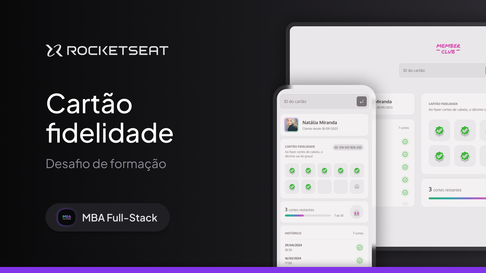

<p align="center">
  
</p>

<p align="center">
O projeto é um site responsivo de cartão fidelidade com o histórico de cortes de cabelo feitos por um clube de membros.
</p>

<p align="center">
  <a href="https://mba-member-club.vercel.app/" target="__blank">Visualização do projeto</a>
  &nbsp;&nbsp;&nbsp;|&nbsp;&nbsp;&nbsp;
  <a href="https://api-member-club.vercel.app/" target="__blank">Visualização da API</a>
</p>

------

<p align="center">
  
</p>

## 🚀 Tecnologias

Esse projeto foi desenvolvido com as seguintes tecnologias:

- HTML
- CSS
- Javascript
- Webpack
- Toastify
- JSON Server

## 👨‍💻 Como utilizar

IDs de teste:
- 124-537-835-230
- 207-245-699-104
- 523-114-876-908

Você vai precisar do [Git](https://git-scm.com) e [Node.js](https://nodejs.org/en/download/) (versão 20.12.0 ou maior) para utilizar o projeto em sua máquina local.

No seu terminal, clone e rode o projeto:

```bash
# Clone o repositório
git clone https://github.com/rmmena123/mba-member-club.git

# Vá para a pasta do repositório
cd mba-member-club

# Instale as dependências
npm install

# Inicie um servidor local
npm run dev
```

Caso queira testar novos dados da API é possível iniciar um servidor local utilizando o json-server e alterar os dados no arquivo `server.js`, da seguinte forma:

```bash
# 1 - Vá para o arquivo api-config.js, em src\services\api-config.js
# 2 - Troque a baseURL por "http://localhost:3333"
# 3 - Rode o comando:
npm run server
```
